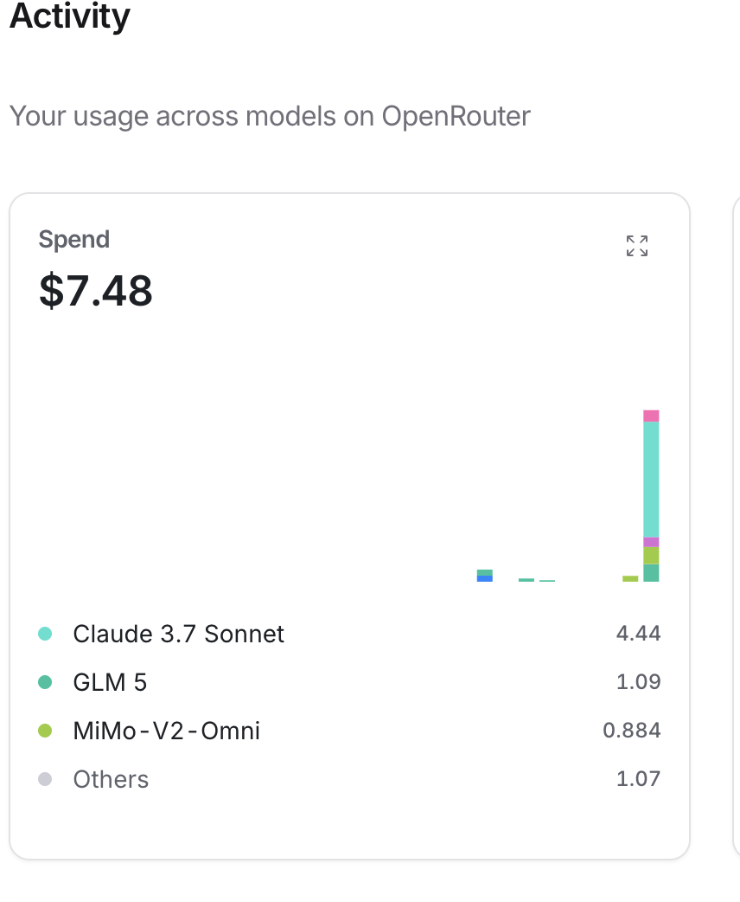

# Jackpot+

Gets rid of the gambling theme of [jackpot](https://jackpot.hackclub.com/) and also fixes some questionable ux choices

## What It Does

- Gets rid of the gambling/las vegas theme
- Tracks hours and earnings (50 chips = $6 = 1 hour)
- Goals system 
- Better shop navigation

## Install

1. Download the repo as a zip ([here](https://github.com/some-du6e/Jackpot-/archive/refs/heads/main.zip))
3. Unzip it
2. Go to chrome://extensions in ur chromium browser (chrome)
3. Turn on Developer Mode.
4. Load the Jackpot- folder where u .
5. Visit jackpot.hackclub.com.

## Contribute

Make a issue and put some prompt and i will feed it to whatever model u want (using copilot as a harness)

### Dear reviewer
I dont mind if it gets denied, but i would atleast would like half of the chips to be given cuz i need it to buy the ai credits grant bc of this:
